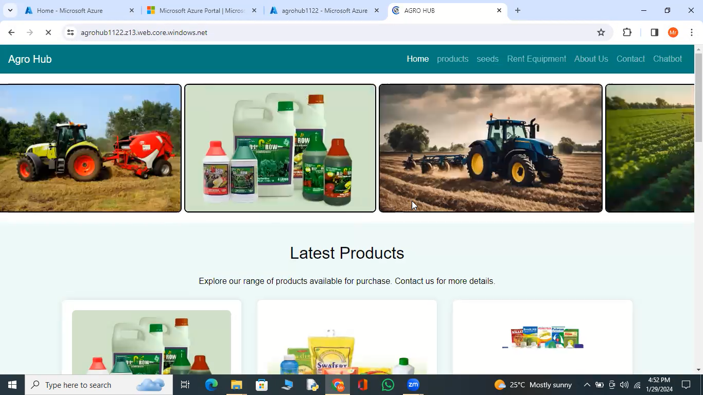

<h1>Agro Hub:</h1>
......

Transforming Tomorrow with Affordable Tech Solutions Today.

<h1>Project Details</h1>

1.	Project Demo URL:https://agrohub1122.z13.web.core.windows.net/ 
2.	Demo Video URL:https://youtu.be/nFtwszuQOe8?si=qAjxWjtS8kFUKUi  
3.	GitHub Repository URL :https://github.com/eshwar3240/Az_Project_Agro_Hub-main/ 
4.	Industry : E-commerce (Agriculture) 

<h1>Roles & Responsibilities:</h1>

1)  <h6>Eshwar</h6> (Development & Deployment ): Responsibe for Development and Deployment of code. .

2)  <h6>Mohd Aleem</h6> (Documentation Management): Responsible for managing the documentation process.

3)  <h6>Erindla Krishna</h6> (Content Management): Responsible for Managing the website content.

4)  <h6>Rangu Gayathri</h6> (Project management): Responsible for managing the project description.

<h1>Azure services used:</h1>

1.	Azure Storage account
2.	Azure Blob Storage
3.	Azure Backup service
4.	Azure AI services

<h1>Problem Statement:</h1>

The agriculture sector plays a pivotal role in global food production, yet small and medium-sized farmers often face significant challenges in accessing modern and specialized agricultural equipment due to high upfront costs and limited availability. This creates a barrier to adopting efficient farming practices, resulting in decreased productivity, higher operational costs, and environmental inefficiencies.
Existing rental solutions in the agriculture equipment domain are often fragmented, offline, and lack transparency. Farmers struggle to find the right equipment for their specific needs, face uncertainties regarding the quality and maintenance of rented machinery, and encounter logistical challenges in terms of delivery and pickup.
Hence, there is a critical need for a comprehensive and technology-driven agriculture equipment rental platform. Such a platform would address the challenges faced by farmers by providing a transparent, user-friendly, and centralized solution that enables efficient renting of agricultural equipment, contributing to increased productivity, reduced operational costs, and the overall advancement of sustainable farming practices.

<h1>Project Description:</h1>

Agro Hub Solutions is a pioneering project aimed at revolutionizing the agricultural landscape by introducing an advanced platform that facilitates the seamless rental of agricultural vehicles and fertilizers. This innovative approach addresses the challenges faced by farmers in accessing expensive equipment and high-quality fertilizers, thereby enhancing efficiency and productivity in the agricultural sector.

<h1>Core Azure Services:</h1>

Azure Blob Storage:- Azure Blob Storage is Microsoft's scalable object storage solution in the Azure cloud. It enables secure and cost-effective storage of unstructured data, such as documents and images. Offering seamless integration with applications, it supports data of any size and optimizes accessibility through a globally distributed network. 

Azure Storage Account:- Azure Storage Account is a foundational component in Microsoft Azure, providing secure and scalable cloud storage. It supports various storage services like Blob, File, Queue, and Table, accommodating diverse data types. With features such as redundancy options and access controls, it ensures reliable and efficient data management.

 Azure Backup Service:- Azure Backup Service by Microsoft safeguards critical data in the Azure cloud. It offers automated and scalable backup solutions for virtual machines, applications, and files. With features like long-term retention and geo-redundancy, it ensures data resilience and facilitates efficient disaster recovery, enhancing overall data protection strategies.

<h1>Azure AI Service</h1>

Azure Chatbot :- The Azure AI Language Chatbot is a cutting-edge conversational agent powered by Microsoft's Azure platform. Leveraging advanced natural language processing capabilities, it facilitates dynamic and context-aware interactions. This intelligent chatbot employs machine learning algorithms to comprehend user queries, providing personalized responses and assistance across diverse domains. Seamlessly integrating with Azure services, it ensures scalability and reliability.

<h1>Screenshot’s:</h1>
<b>Storage account</b>

<b>Static Website.....</b>

<b>Container.....</b>

<b>Azure Data Protection service</b>

<b>Azure AI serivce chatbot</b>

<b>Chatbot Test</b>

<h1>Description</h1>

Here I am attaching the final working website's screenshot for the reference.

<h1>Working Live Project Display:</h1>

<h1>Final Project Statement:</h1>

Empowering Agriculture Through Equipment Accessibility: Our final project aims to establish a robust online platform connecting farmers with a diverse range of rental agricultural equipment. By providing a user-friendly interface, we strive to facilitate efficient, cost-effective, and sustainable farming practices. This initiative seeks to enhance accessibility to modern agricultural machinery, promoting increased productivity and reducing the economic burden on farmers. Through the seamless rental process, we aspire to contribute to the advancement of the agricultural sector while fostering community collaboration and resource optimization.
